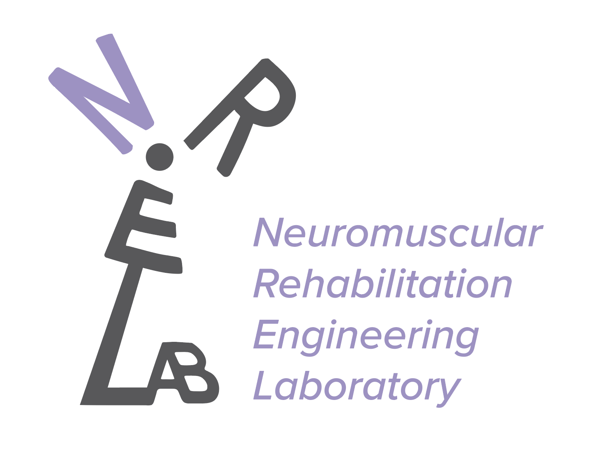

## Logo \& T-Shirt Design Update

**Effective Date:** May 1, 2025

### New Logo: Windmill Symbol

- **Design Concept:**
The new logo features a **windmill symbol** where the letters **N, R, and E** form the circular wind turbine blades. This design represents the interdisciplinary core of the lab’s work.
- **Front Logo Preview:**

  

### Walking Woman T-Shirt Design

- **Design Concept:**
The T-shirt features the figure of a **walking woman** that prominently displays the exoskeleton and prosthesis elements. It symbolizes the lab’s commitment to diversity, inclusion, and support for underrepresented groups and all genders.
- **Back Logo Preview:**

  

## High Resolution Files
Vector graphs for both the front and back designs are available in the respective subfolders of this repository.

## Use Policy:
- These logo files are intended for official lab use only. Please do not distribute or modify without prior approval.
- If you have any questions or require additional permissions, please contact the lab design team.

Thank you for supporting the NREL Lab’s mission and visual identity!

