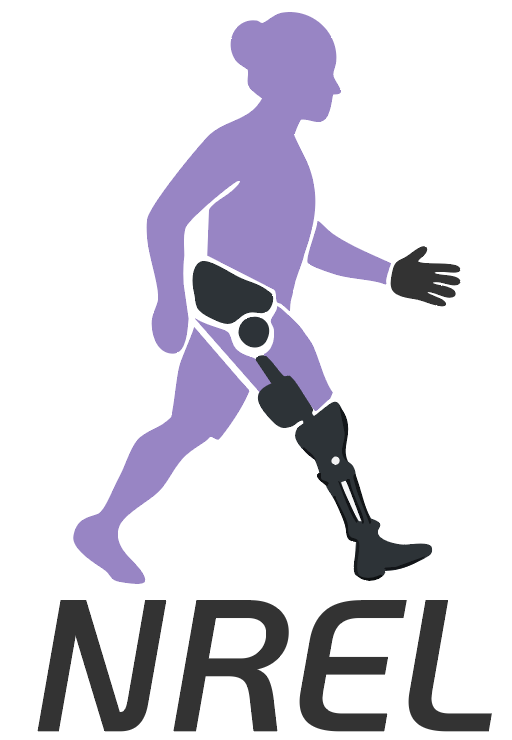

## Logo \& T-Shirt Design Update

**Effective Date:** May 1, 2025

### New Logo: Windmill Symbol

- **Design Concept:**
The new logo features a **windmill symbol** where the letters **N, R, and E** form the circular wind turbine blades. This design represents the interdisciplinary core of the lab’s work.
- **Front Logo Preview:**

  

### Walking Woman T-Shirt Design

- **Design Concept:**
The T-shirt features the figure of a **walking woman**, symbolizing the lab’s commitment to diversity, inclusion, and support for underrepresented groups and all genders.
- **Back Logo Preview:**

  

## Summary

- **Front:** Windmill logo (N, R, E as blades)
- **Back:** Walking Woman design for diversity and inclusion

For questions or access to high-resolution files, please contact the lab design team.

